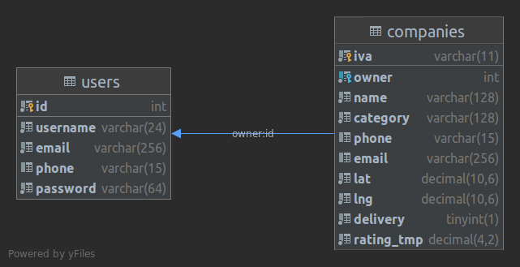
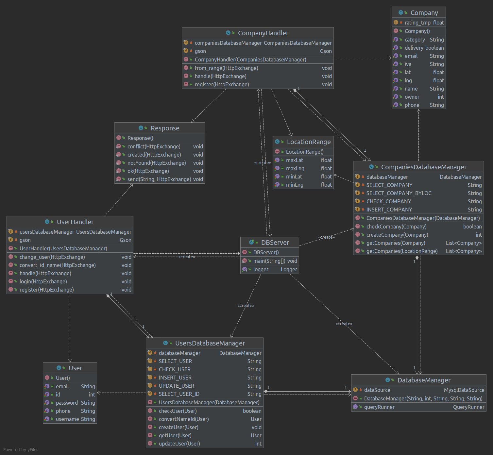

# Candy 🍬
Donut's database handler
## Database

### Structure
The database is currently (and temporary) composed of two tables:
 - users, which handles all of the login and contact info
 - companies, linked with users through owner (companies) -> id (user), which contains the companies legal and contact data
### Projects
- A reviews table to feed the algorithm
- Some kind of weird query to get the closest name
- Some way to store tokens and handle authorizations (maybe Kerberos but it's kinda overkill)
## The RESTful API

TODO:
- Migrate to Spring, because it's better™
- Better way to handle the starting process (also a credentials storage)
- Better logging
### User API
#### POST /db/user/login
Params: (username\*, email\*, password)
\* = At least one

Response: (id, username, email, phone) 200 OK
*TODO: Return a token*
404 NOT FOUND if no user meets the requirements

#### POST /db/user/register
Params: (id, username, email, phone*, password)
\* = Optional

Response: 201 CREATED
*TODO: Return a token*
409 CONFLICT if a user already exists (checks id, username, email and phone)

#### POST /db/user/change_user
Params: (id\*, username\*, email\*\*, phone\*\*, password\*\*)
\* = At least one
\*\* = At least one

Response: 200 OK
*TODO: Return a token*
404 NOT FOUND if no user meets the requirements

#### POST /db/user/convert_id_name
Params: (id\*, username\*)
\* = At least one

Response: (id, username) 200 OK
*TODO: Return a token*
404 NOT FOUND if no user meets the requirements

### Company API
#### POST /db/company/register
Params: (owner, iva, name, category, phone\*, email\*, lat, lng, delivery\*\*, rating_tmp\*\*)
\* = At least one
\*\* = Should be moved to another table

Response: 201 CREATED
*TODO: Return a token*
409 CONFLICT if a company already exists (checks name, owner, email, phone, iva)

#### POST /db/company/from_range
Params: (minLat, maxLat, minLng, maxLng)

Response: List of (owner, iva, name, category, phone, email, lat, lng, delivery\*, rating_tmp\*) 200 OK
\* = Should be moved to another table
