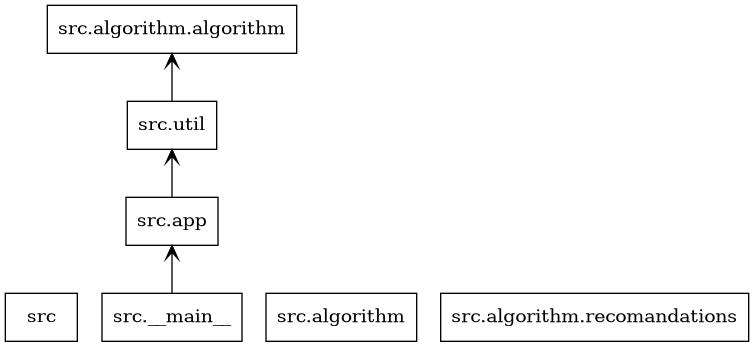

# Dough 🫓

## Description
Dough is a RESTful-like API server which handles the app's logic

## Project Structure

## Dependencies
- [Flask](https://flask.palletsprojects.com/en/1.1.x/)
- [Requests](https://docs.python-requests.org/)

## Endpoints

### POST /register
#### Request structure
    {
        "mail": "jojo@example.com",
        "username": "lmao",
        "phone": "69420666",
        "password": "sus"
    }
#### Response structure
    {
        "token":"38798738"
    }
#### Error
    {
        "status": 550, // this is a random status code
        "error": "error explaination"
    }

### POST /login
#### Request structure
    {
        "username": "jojo@example.com",
        "password": "sus"
    }
#### Response structure
    {
        "token":"3873253223"
    }
#### Error
    {
        "status": 550, // this is a random status code
        "error": "error explaination"
    }

### POST /modify
TODO

### POST /resolve
#### Request structure
##### Get user_id from username
    {
        "username": "example"
    }
##### Get username from user_id
    {
        "user_id": "123456"
    }
#### Response structure
    {
        "user_id": "123456",
        "username": "example"
    }
#### Error
    {
        "status": 550, // this is a random status code
        "error": "error explaination"
    }

### POST /search
TODO
